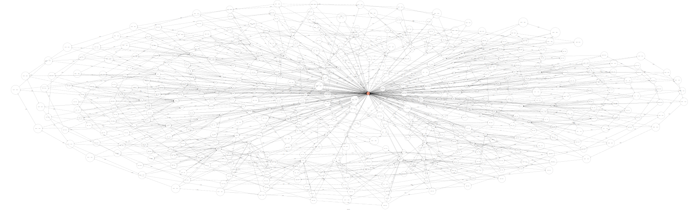

# TOC Project 2020

The third homework of Theory of Computation.

A LINE bot written in python3 and now deployed on Heroku.

## Bot information

Bot basic ID: @578aojha


Scan the code above and have a lot of fun!

## Requirements

- `python3.6`
- `graphviz`
- `graphviz-dev`

## Installation

```sh
pip install pipenv
pipenv --python 3.6
pipenv install
pipenv shell
```

## Execution

Before execution, `.env` file has to be created. That is, you have to get a
**Channel access token** and a **Channel secret** from LINE Developers. After
getting the access token and the secret, you should paste them in your `.env`
file. The format of `.env` file can refer to `.env.sample`.

After setting up `.env`, you can run any of the following command:

```sh
gunicorn app:app
# or
python app.py
```

## Simple Usage

1. Go to any station by typing the name of a station or its station code. For
   instance, "台北車站" ,"BL12", and "R10" are all valid to travel to Taipei
   Main Station
2. Click any button if you are at a station or on the train
3. The same message is replied if the bot gets the invalid text to the bot

## Homework Requirements

### Finite State Machine



The graph above is a finite state machine with 466 states and 1261 transitions,
which is actually the route map of Taipei Metro.

### Demonstration

Here is a screenshot of replies of the bot.


## Roadmap

- [ ] Add favicon
- [ ] Segment files
- [ ] Add multilingual versions
- [ ] Rewrite root page
- [ ] Add database
- [ ] Enrich contents
- [ ] Add broadcast audio

## References

### Homework References

- [Slides 2020](https://docs.google.com/presentation/d/1HSf3-m6_h9Uv2N_y9mgOG6fOho-bRhl0oInhHdC45ZU)
- [Slides 2019](https://hackmd.io/@TTW/ToC-2019-Project)
- [FAQ 2018](https://hackmd.io/s/B1Xw7E8kN)
- [line/line-bot-sdk-python](https://github.com/line/line-bot-sdk-python)
- [pytransitions/transitions](https://github.com/pytransitions/transitions)
- [CrazyRyan0812/CrazyRyan-TOC](https://github.com/CrazyRyan0812/CrazyRyan-TOC)

### Content References

- [Flex simulator](https://developers.line.biz/flex-simulator/)
